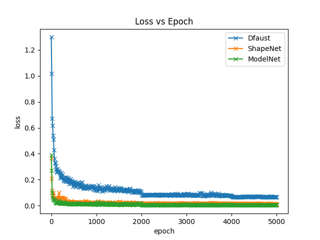
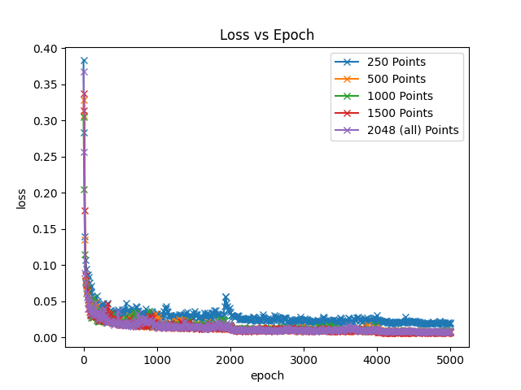
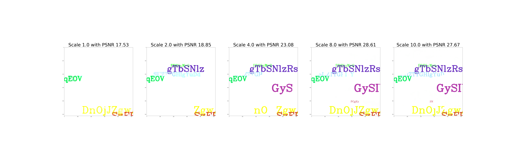

# Implicit functions - Week 9 Group 1
Papers covered in our repo:
* 	DeepSDF: Learning Continuous Signed Distance Functions for Shape Representation, Park, Florence, Straub, Newcombe, Lovegrove; 2019
* 	Occupancy Networks: Learning 3D Reconstruction in Function Space, Mescheder, Oechsle, Niemeyer, Nowozin, Geiger; 2018
* 	Implicit Geometric Regularization for Learning Shapes, Gropp, Yariv, Haim, Atzmon, Lipman; 2020
* 	Fourier Features Let Networks Learn High Frequency Functions in Low Dimensional Domains, Tancik, Srinivasan, Mildenhall, Fridovich-Keil, Raghavan, Singhal, Ramamoorthi, Barron, Ng; 2020
* 	Implicit Neural Representations with Periodic Activation Functions, Sitzmann, Martel, Bergman, Lindell, Wetzstein; 2020

### Datasets
Each paper had different datasets processed specifically for their models. Finding common datasets was challenging. The following datasets were used across the models:
* DFaust
* ShapeNetCore V2
* ModelNet 10
* **TODO: Add other datasets**

### Architectures
Each paper presented different applications and networks, so there is no common backbone network for this project.

## Reference
* DeepSDF repository, by Schmidt, T. (facebookresearch). https://github.com/facebookresearch/DeepSDF
* **TODO: Add other repos**

# IGR: Implicit Geometric Regualrization for Learning Shapes

[Implementation of IGR can be found here](https://github.com/amosgropp/IGR)

Reconstructing Surfaces
-

IGR introduces a simple loss function to be able to recreate surfaces
given point cloud data.

I ran a set of ablation tests and compared results across datasets

## Long Test: Shows reconstruction loss through 25,000 epochs

## Loss Ablations 5k Epochs

- Normal Baseline
- No Eikonal Norm
- Emphasized Eikonal Norm
- No Normal 

## Optimizer Tests 5k Epochs

- Adam (original)
- AdamW 
- AdaDelta 

## Dataset Comparisons 5k Epochs

- DFaust 
- ShapeNetCore V2
- ModelNet 10

## Point Cloud Sampling Test 5k Epochs

Sampling points per batch at 
- 250 per batch
- 500 per batch
- 1000 per batch
- 2048 (all) per batch

## Take Aways For IGR

- Normals are extremely helpful for complex shapes
- IGR is bad at finding holes
- Eikonal norm will help train slightly faster (finer details)
- All points are useful for single shape reconstruction
- Adaptive Learning Rate optimizers are not helpful
- Finer details appear after long epochs with diminishing returns

## Table of Results for IGR

| Experiment  | Epochs | Loss | Created Reasonable Mesh |
| ------------- | ------------- | ------------- | ------------- |
| Long Test  | 25,000  | 0.05 | yes |
| Baseline  | 5,000  | .066 | yes |
| No Eikonal  | 5,000  | 0.065 | yes |
| Eikonal @ 0.5  | 5,000  | 0.068 | yes |
| No Norms  | 5,000  | 0.002 | No |
| AdamW  | 5,000  | 0.07 | yes |
| AdaDelta  | 5,000  | 0.25 | yes |
| ShapeNet Phone  | 5,000  | .01 | yes |
| ModelNet Table  | 5,000  | 0.003 | yes* (filled in holes) |
| ShapeNet Speaker @ 250pts  | 5,000  | 0.019 | yes |
| ShapeNet Speaker @ 500pts  | 5,000  | 0.008 | yes |
| ShapeNet Speaker @ 1000pts  | 5,000  | 0.006 | yes |
| ShapeNet Speaker @ 1500pts  | 5,000  | 0.008 | yes |
| ShapeNet Speaker @ 2048pts (all)  | 5,000  | 0.007 | yes |

# Fourier Features Let Networks Learn High Frequency Functions in Low Dimensional Domains

# 

# 

#### Nature picture PSNR

#### Text picture PSNR

# SIREN: Implicit Neural Activations with Periodic Activation Functions

## Image Reconstruction

SIREN optimizes the implicit function as a form of an equation of their gradients, laplacians, higher order terms etc.

The following example shows the process of SIREN approximating an image with and the gradients, laplacians over time.

## Poisson Equation

Since SIREN approximates the underlining function wrt. constraints about its differentials at any order, it's easy to solve the Poisson equation by construction.

We construct the constraints by gradients in order to do so assuming the gradients are everything we know.

The following example shows that SIREN resonably reconstructed the original image.

