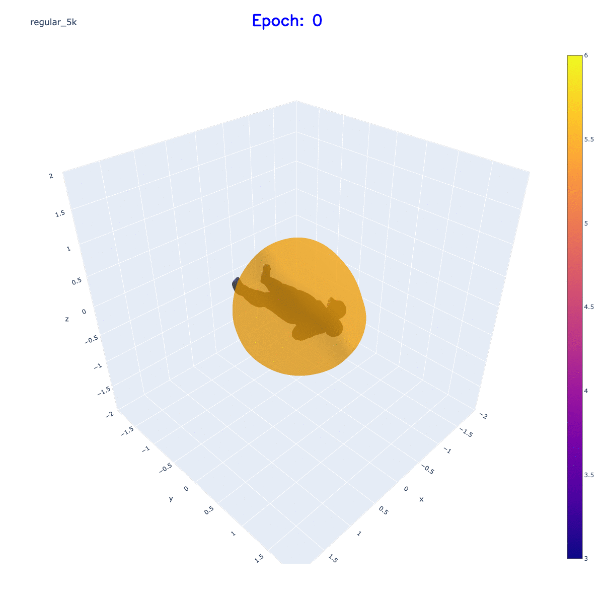
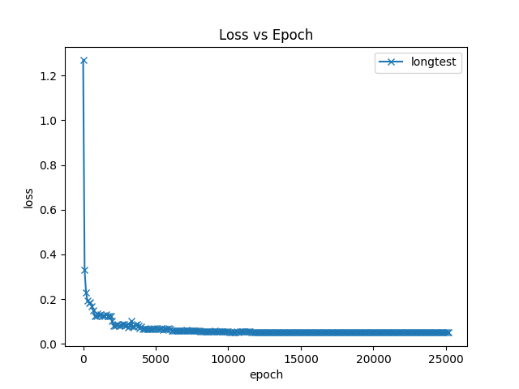
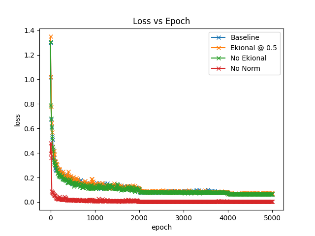
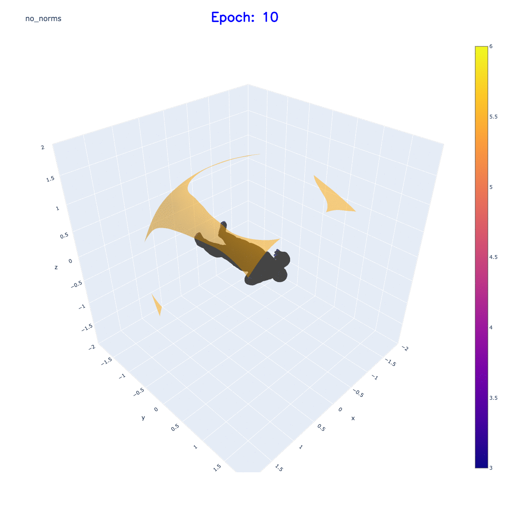
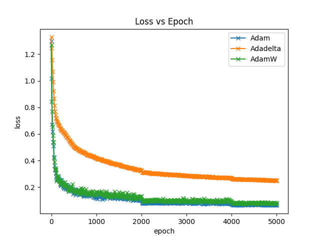
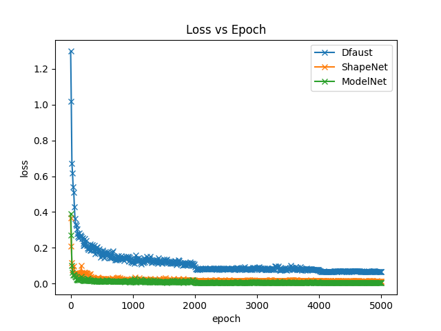
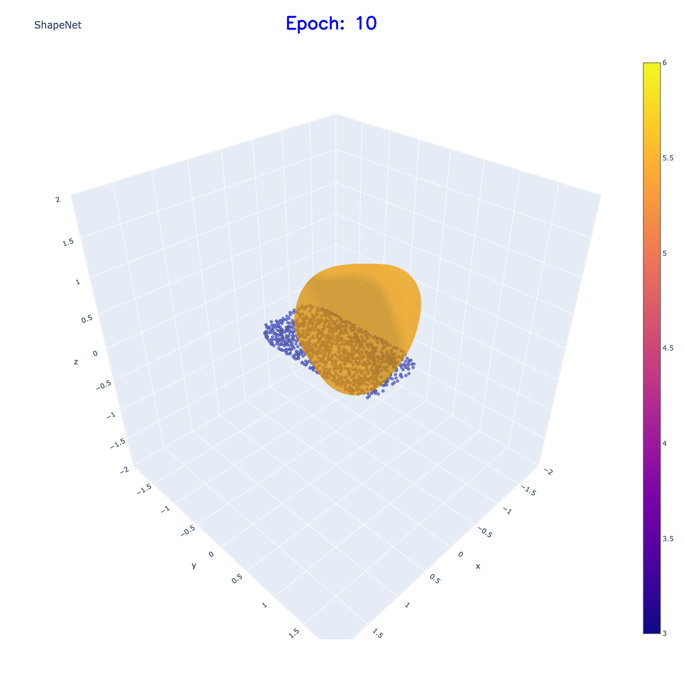
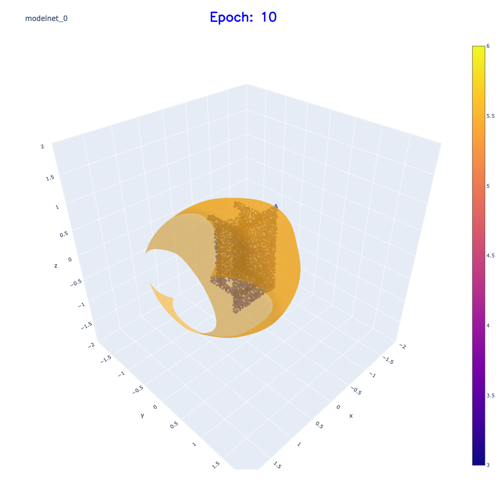
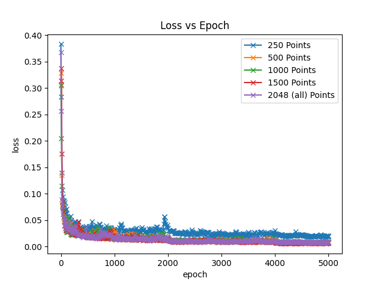

# IGR: Implicit Geometric Regualrization for Learning Shapes

Reconstructing Surfaces
-

IGR introduces a simple loss function to be able to recreate surfaces
given point cloud data.

I ran a set of ablation tests and compared results across datasets

## Long Test: Shows reconstruction loss through 25,000 epochs
    

## Loss Ablations 5k Epochs

- Normal Baseline
- No Eikonal Norm
- Emphasized Eikonal Norm
- No Normal 

## Optimizer Tests 5k Epochs

- Adam (original)
- AdamW 
- AdaDelta 

## Dataset Comparisons 5k Epochs

- DFaust 
- ShapeNetCore V2
- ModelNet 10

## Point Cloud Sampling Test 5k Epochs

Sampling points per batch at 
- 250 per batch
- 500 per batch
- 1000 per batch
- 2048 (all) per batch

# Take Aways

- Normals are extremely helpful for complex shapes
- IGR is bad at finding holes
- Eikonal norm will help train slightly faster (finer details)
- All points are useful for single shape reconstruction
- Adaptive Learning Rate optimizers are not helpful
- Finer details appear after long epochs with diminishing returns